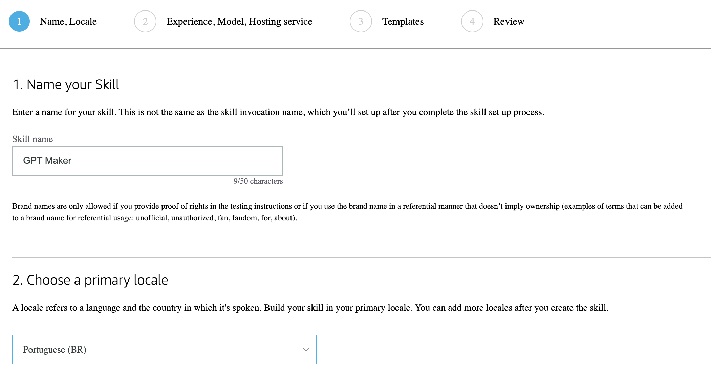
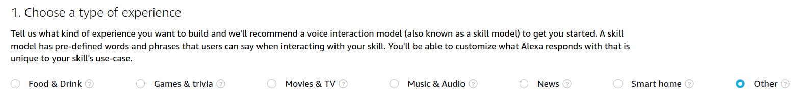
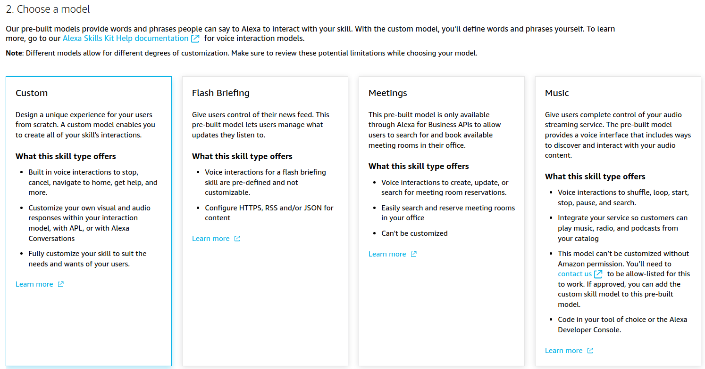
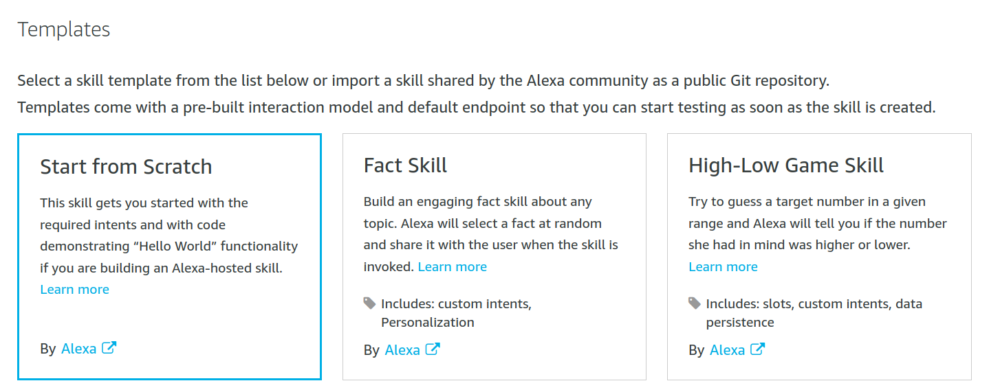
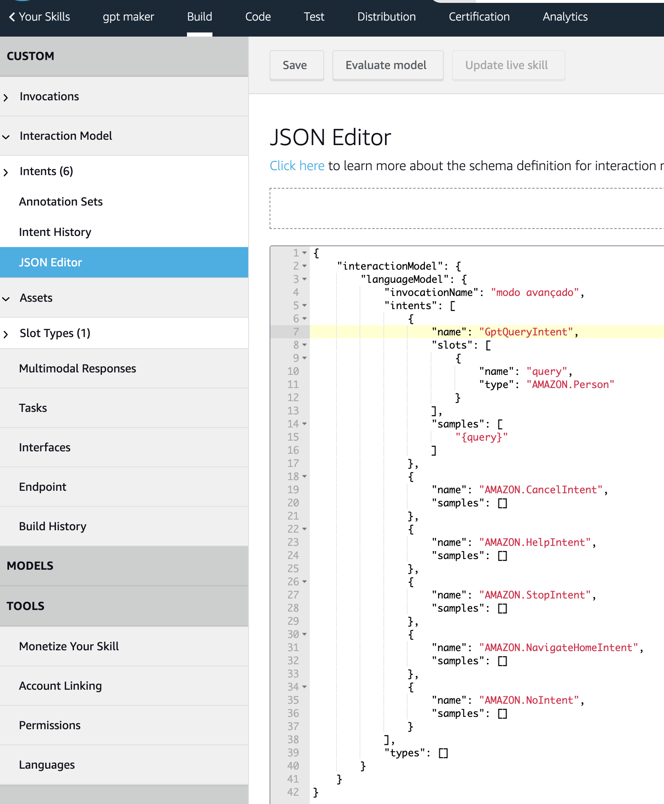
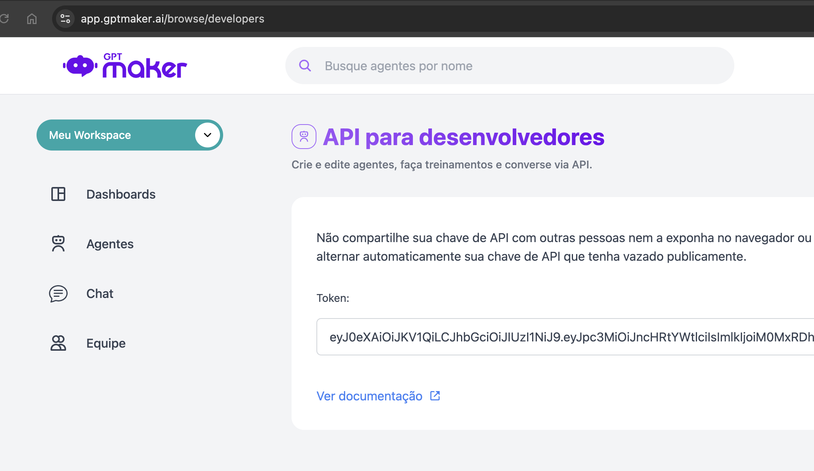
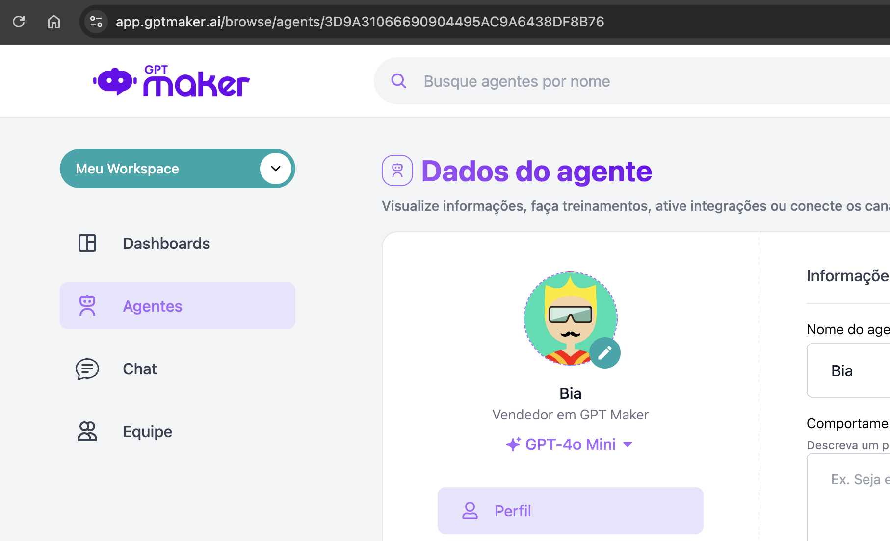
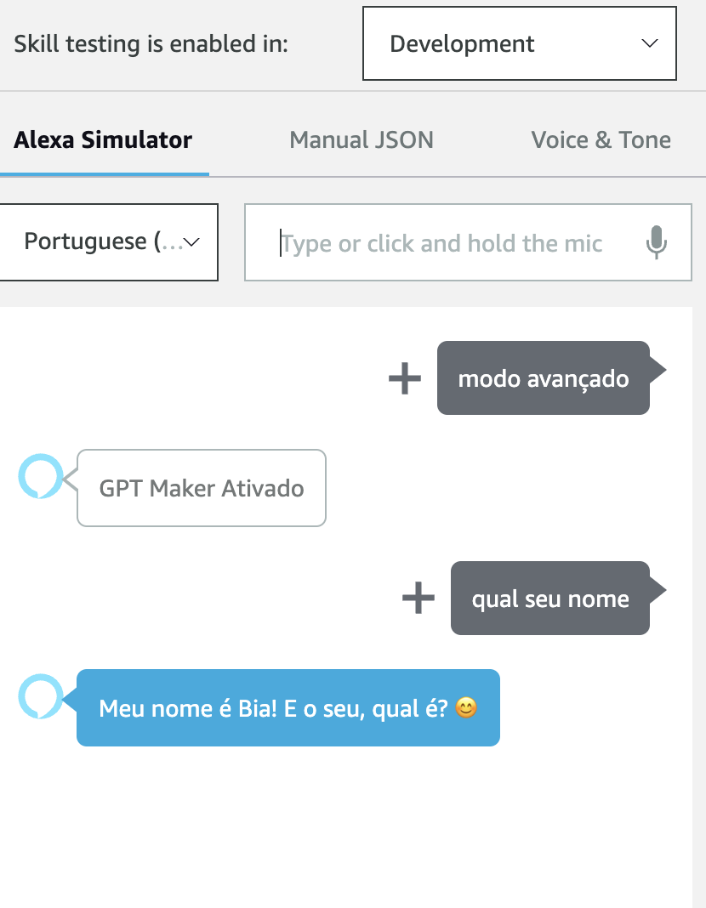

# Alexa GPT MAKER

Melhore sua Alexa fazendo-a responder como GPT Maker.

Este repositório contém um tutorial sobre como criar uma skill simples da Alexa que usa a GPT Maker para gerar respostas do modelo ChatGPT.

## Pré-requisitos

- Uma [Conta de desenvolvedor da Amazon](https://developer.amazon.com/)
- Uma [Conta GPT Maker](https://gptmaker.ai)

## Tutorial passo a passo

### 1. <span name=item-1></span>

Faça login na sua conta de desenvolvedor da Amazon e navegue até [Alexa Developer Console](https://developer.amazon.com/alexa/console/ask).

### 2.

Clique em "Criar Skill" e nomeie a skill como "GPT Maker". Escolha o local primário de acordo com seu idioma.



### 3.

Escolha "Outro" e "Personalizado" para o modelo.





### 4.

Escolha "Hospedado pela Alexa (Python)" para os recursos de backend.


### 5.

Selecione "Start from Scratch" e clique em "Next" para continuar, na tela seguinte clique em "Criar habilidade".



### 6.

Na seção "Build", navegue até a aba "Interaction Model" -> "JSON Editor" e insira o conteúdo abaixo:

```json
{
  "interactionModel": {
    "languageModel": {
      "invocationName": "modo avançado",
      "intents": [
        {
          "name": "GptQueryIntent",
          "slots": [
            {
              "name": "query",
              "type": "AMAZON.Person"
            }
          ],
          "samples": ["{query}"]
        },
        {
          "name": "AMAZON.CancelIntent",
          "samples": []
        },
        {
          "name": "AMAZON.HelpIntent",
          "samples": []
        },
        {
          "name": "AMAZON.StopIntent",
          "samples": []
        },
        {
          "name": "AMAZON.NavigateHomeIntent",
          "samples": []
        }
      ],
      "types": []
    }
  }
}
```

Exemplo de como vai ficar:



### 7.

Clique para salvar o modelo como mostra a imagem acima, depois clique em buildar o modelo, um botão azul escrito "Build Skill".

### 8.

Vá para a seção "Code" e adicione a configuração abaixo ao requirements.txt. Seu requirements.txt deve ficar assim:

```txt
ask-sdk-core==1.11.0
boto3==1.9.216
requests>=2.20.0
```

### 9.

Agora precisamos ter em mãos a chave de API do GPT Maker e um ID de um agente que será conectado a alexa.

Acesse a página [Chave de API](https://app.gptmaker.ai/browse/developers) e copie seu token.



Obtenha também o ID do agente que deseja conectar, você pode obter facilmente pela URL, por exemplo:



Na imagem acima o ID do agente seria o final da URL, exemplo: 3D9A31066690904395AC9A6438DF8B76.

### 10.

Substitua seu arquivo lambda_functions.py pelo conteúdo abaixo.
Lembre-se de alterar os valores de **gpt_maker_api_key** e **agent_id** de acordo com seus dados.

```python
from ask_sdk_core.dispatch_components import AbstractExceptionHandler
from ask_sdk_core.dispatch_components import AbstractRequestHandler
from ask_sdk_core.skill_builder import SkillBuilder
from ask_sdk_core.handler_input import HandlerInput
from ask_sdk_model import Response
import ask_sdk_core.utils as ask_utils
import requests
import logging
import json

# Configure seus dados do GPT Maker.
gpt_maker_api_key = "SEU TOKEN AQUI"
agent_id = "ID DO AGENTE AQUI";

logger = logging.getLogger(__name__)
logger.setLevel(logging.INFO)

class LaunchRequestHandler(AbstractRequestHandler):
    """Manipulador para lançamento de habilidades."""
    def can_handle(self, handler_input):
        # type: (HandlerInput) -> bool

        return ask_utils.is_request_type("LaunchRequest")(handler_input)

    def handle(self, handler_input):
        # type: (HandlerInput) -> Response
        speak_output = "GPT Maker Ativado"

        session_attr = handler_input.attributes_manager.session_attributes
        session_attr["chat_history"] = []

        return (
            handler_input.response_builder
                .speak(speak_output)
                .ask(speak_output)
                .response
        )

class GptQueryIntentHandler(AbstractRequestHandler):
    """Manipulador para intenção de consulta Gpt Maker."""
    def can_handle(self, handler_input):
        # type: (HandlerInput) -> bool
        return ask_utils.is_intent_name("GptQueryIntent")(handler_input)

    def handle(self, handler_input):
        # type: (HandlerInput) -> Response
        query = handler_input.request_envelope.request.intent.slots["query"].value

        session_attr = handler_input.attributes_manager.session_attributes
        if "chat_history" not in session_attr:
            session_attr["chat_history"] = []
        response = generate_gpt_response(session_attr["chat_history"], query)
        session_attr["chat_history"].append((query, response))

        return (
                handler_input.response_builder
                    .speak(response)
                    .ask("Alguma outra pergunta?")
                    .response
            )

class CatchAllExceptionHandler(AbstractExceptionHandler):
    """Tratamento de erros genérico para capturar quaisquer erros de sintaxe ou roteamento."""
    def can_handle(self, handler_input, exception):
        # type: (HandlerInput, Exception) -> bool
        return True

    def handle(self, handler_input, exception):
        # type: (HandlerInput, Exception) -> Response
        logger.error(exception, exc_info=True)

        speak_output = "Desculpe, tive problemas para fazer o que você pediu. Por favor, tente novamente."

        return (
            handler_input.response_builder
                .speak(speak_output)
                .ask(speak_output)
                .response
        )

class NoIntentHandler(AbstractRequestHandler):
    def can_handle(self, handler_input):
        return ask_utils.is_intent_name("AMAZON.NoIntent")(handler_input)

    def handle(self, handler_input):
        # Ao detectar que o usuário disse "não"
        speak_output = "Saindo do modo avançado do GPT Maker."
        return (
            handler_input.response_builder
                .speak(speak_output)
                .set_should_end_session(True)  # Encerra a sessão
                .response
        )

class CancelOrStopIntentHandler(AbstractRequestHandler):
    """Manipulador único para Cancelar e Parar Intenção."""
    def can_handle(self, handler_input):
        # type: (HandlerInput) -> bool
        return (ask_utils.is_intent_name("AMAZON.CancelIntent")(handler_input) or
                ask_utils.is_intent_name("AMAZON.StopIntent")(handler_input))

    def handle(self, handler_input):
        # type: (HandlerInput) -> Response
        speak_output = "Saindo do modo avançado do GPT Maker"

        return (
            handler_input.response_builder
                .speak(speak_output)
                .response
        )


def generate_gpt_response(chat_history, new_question):
    """Envia 'contextId' e 'prompt' para a nova API GPTMaker."""
    headers = {
        "Authorization": f"Bearer {gpt_maker_api_key}",
        "Content-Type": "application/json"
    }
    url = f"https://api.gptmaker.ai/v2/agent/{agent_id}/conversation"

    # Corpo da requisição, com o ID e o prompt
    data = {
        "contextId": "alexa",
        "prompt": new_question
    }

    try:
        response = requests.post(url, headers=headers, data=json.dumps(data))
        response_data = response.json()

        if response.ok:
            return response_data.get("message", "Resposta sem campo 'message'.")
        else:
            return f"Erro {response.status_code}: {response_data}"
    except Exception as e:
        return f"Erro ao gerar resposta: {str(e)}"

sb = SkillBuilder()

sb.add_request_handler(LaunchRequestHandler())
sb.add_request_handler(GptQueryIntentHandler())
sb.add_request_handler(NoIntentHandler())
sb.add_request_handler(CancelOrStopIntentHandler())
sb.add_exception_handler(CatchAllExceptionHandler())

lambda_handler = sb.lambda_handler()
```

### 11.

Salvar e implantar. Vá para a seção "Test" e habilite "Teste de habilidade" em "Desenvolvimento".


### 12.

Agora você está pronto para usar sua Alexa no modo GPT Maker em TODOS seus dispositivos conectado a sua conta alexa. Você deve ver resultados como estes:



Observe que executar esta habilidade incorrerá em custos para usar tanto o AWS Lambda quanto a GPT Maker. Certifique-se de entender a estrutura de preços e monitorar seu uso para evitar cobranças inesperadas.
